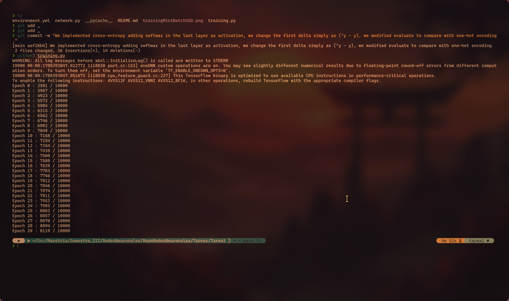
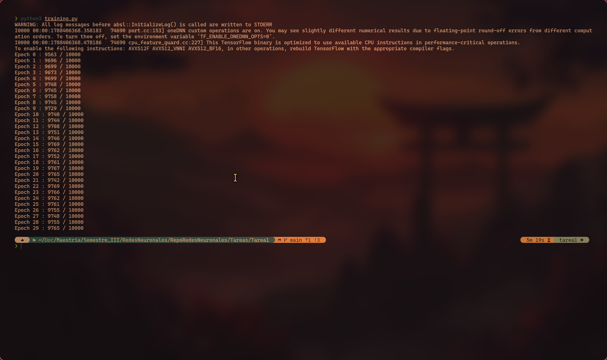

# README
## First training SGD MSE
Screenshot of training with SGD mini-batch using mnist, eta = 0.01, epoch = 30, batch_size = 120, sizes=[784,240,120,10].
\

## Training with Cross-Entropy
Screenshot of training with Cross-Entropy with mini-batch SGB using mnist, eta = 0.01, epoch = 30, batch_size = 120, sizes=[784,240,120,10].
We can see an amazing improvement!!

## Training with better weight initialization and with ADAM
Screenshot of training with Cross-Entropy with mini-batch SGB using mnist, eta = 0.01, epoch = 30, batch_size = 120, sizes=[784,240,120,10].
We can see an incredible improvement!!!
